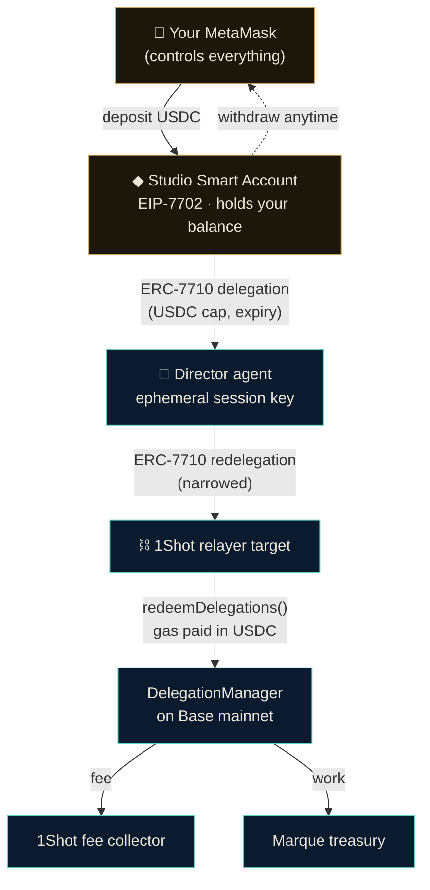
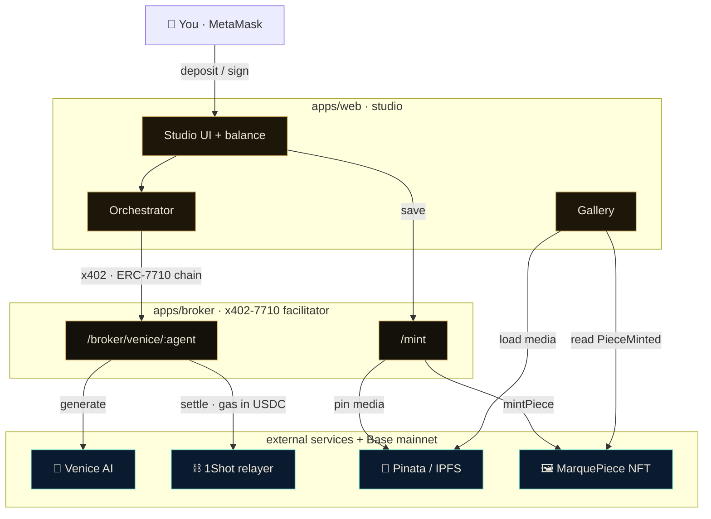
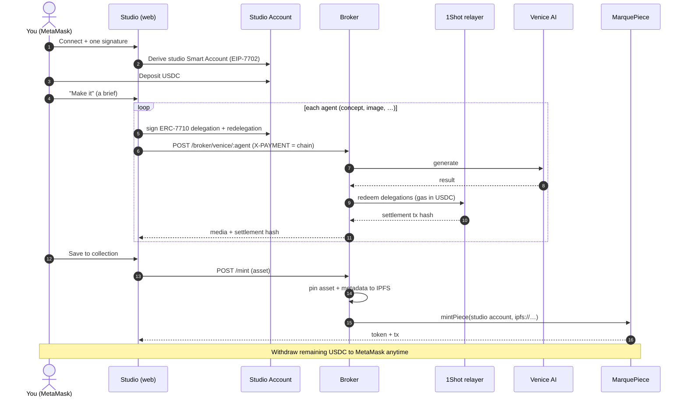

<div align="center">

# Marque

**Every premium AI model, one budget, no subscription.**

Describe what you want → agents make it → you pay only for what it costs, in USDC, on-chain → you own the result.

[](https://basescan.org/address/0x478Bb80C56a708ded5A2f3D2EA0d204aEE92a01b)
[](https://docs.metamask.io/smart-accounts-kit/)
[](https://1shotapi.com/)
[](https://venice.ai/)

</div>

---

Marque is a creative studio where autonomous AI agents carry a **scoped, revocable MetaMask Smart Account delegation** as their entire budget. Describe anything (an image set, a voiceover, a track, a video, or a full ad assembled from all of them) and an agent swarm makes it on **Venice AI**'s premium models, paying per use. Every step settles on **Base mainnet** through the **1Shot permissionless relayer** (gas paid in **USDC**, the agents hold zero ETH) via an **x402 + ERC-7710** facilitator, and the finished piece is minted to you as an NFT with its media pinned to **IPFS**.

## The problem

If you make things, you rent a stack of subscriptions to do it. One tool for images, another for voice, another for music, another for video. Each is priced for *access*, not *usage*, so you pay for every month you barely touch it, the bill climbs past $80 to $100 just to keep the doors open, and you still do not truly own or have provenance for what comes out.

The reason nobody just bills you per use is custody. For an agent to pay per use across all of those services, it has to *hold money*, and there has never been a safe way to do that. An API key is an unbounded drain. A card on file has no revocation and no granularity. A hot wallet is a honeypot. So the industry defaulted to subscriptions, and you pay for idle access instead of the few renders you actually wanted.

Marque removes the custody problem, which removes the subscriptions. You keep **one USDC balance** in a MetaMask Smart Account. When you create, your account **delegates a capped, time-boxed slice** of that balance to an ephemeral agent, which **redelegates** narrower to the relayer that executes the spend. The agent is born, spends inside its envelope, settles on-chain, and dies. Your main wallet never signs a transaction it did not initiate, you pay only for what you make, and you withdraw whatever is left. **The agent carries a budget, not your keys.**

## What you can make

| You ask for | The swarm makes it with |
|---|---|
| **Image sets** | concept copy + Venice image generation |
| **Voiceovers and narration** | script + Venice text-to-speech |
| **Music** | Venice music generation |
| **Video** | Venice video generation |
| **A full ad** | all of the above, assembled into one MP4 |

Every output is paid for per use from the same USDC balance, and minted to you as a MarquePiece NFT with on-chain provenance. None of these is a separate subscription; they are one budget.

## The money & trust model



- **You** keep your keys. Your MetaMask only ever signs a deposit, a withdraw, or the one signature that derives your studio account.
- The **studio account** is a MetaMask Smart Account (Stateless **EIP-7702**), derived deterministically from your signature, recoverable and controlled only by you.
- Each generation step signs a fresh **ERC-7710** delegation capped in USDC and time-boxed, then **redelegates** to the relayer. Caveats enforce the cap on-chain.
- The **1Shot relayer** redeems the chain and pays gas **in USDC**, so the agents never hold ETH.

## System architecture



## End-to-end flow



> **Note on ordering:** the broker **generates first and settles only on success**, so a failed inference never costs you anything.

## Repository layout

```
marque.run/
├─ apps/
│  ├─ web/         Next.js 15 studio: UI, studio account, orchestrator, gallery   → apps/web/README.md
│  └─ broker/      Hono server: the x402-7710 facilitator, IPFS mint, 1Shot       → apps/broker/README.md
├─ contracts/      Foundry: MarquePiece ERC-721 provenance NFT                     → contracts/README.md
├─ packages/
│  ├─ shared/      Zod schemas, the model catalog, constants, errors
│  ├─ delegation/  MetaMask delegation helpers, caveat composition, redemption
│  ├─ x402/        x402 wire types, EIP-3009 helpers
│  └─ agents/      Director orchestrator + specialist harnesses
└─ docs/           API notes, demo script (gitignored)
```

## Tech stack

| Layer | What |
|---|---|
| **Frontend** | Next.js 15 (Turbopack), React 19, Tailwind, framer-motion, wagmi + viem |
| **Smart accounts** | `@metamask/smart-accounts-kit`: EIP-7702 Stateless delegator, ERC-7710 delegation/redelegation |
| **Relayer** | 1Shot permissionless relayer (`relayer_send7710Transaction`), gas in USDC, EIP-7702 authorizations |
| **AI** | Venice AI: chat, image, audio/speech, audio (music), video |
| **Storage** | Pinata / IPFS for asset + ERC-721 metadata |
| **Backend** | Hono on Node 22, deployed behind nginx on a VPS |
| **Contract** | Solidity 0.8.27, Foundry, OpenZeppelin ERC-721 |
| **Chain** | Base mainnet (chainId 8453) |

## Deployed on Base mainnet

| Contract | Address |
|---|---|
| **MarquePiece** (this project) | [`0x478Bb80C56a708ded5A2f3D2EA0d204aEE92a01b`](https://basescan.org/address/0x478Bb80C56a708ded5A2f3D2EA0d204aEE92a01b#code) |
| DelegationManager (MetaMask) | `0xdb9B1e94B5b69Df7e401DDbedE43491141047dB3` |
| EIP7702StatelessDeleGator | `0x63c0c19a282a1B52b07dD5a65b58948A07DAE32B` |
| USDC | `0x833589fCD6eDb6E08f4c7C32D4f71b54bdA02913` |

## Getting started

**Prerequisites:** Node 22+, pnpm 10+ (`corepack enable && corepack prepare pnpm@10.10.0 --activate`), Foundry, a MetaMask wallet on Base mainnet with a little USDC + ETH.

```bash
pnpm install
pnpm typecheck            # typecheck every workspace
pnpm dev:broker           # broker on 127.0.0.1:8789
pnpm dev:web              # studio on localhost:3001
```

Each app has its own setup, env, and architecture notes:

- **[apps/web/README.md](apps/web/README.md)** the studio: studio account, balance drawer, orchestrator, gallery
- **[apps/broker/README.md](apps/broker/README.md)** the facilitator: redemption flow, Venice client, IPFS mint, 1Shot
- **[contracts/README.md](contracts/README.md)** MarquePiece: provenance model, deploy, verify

---

<div align="center">
<sub>Marque · agents that carry a delegation, not your keys.</sub>
</div>
