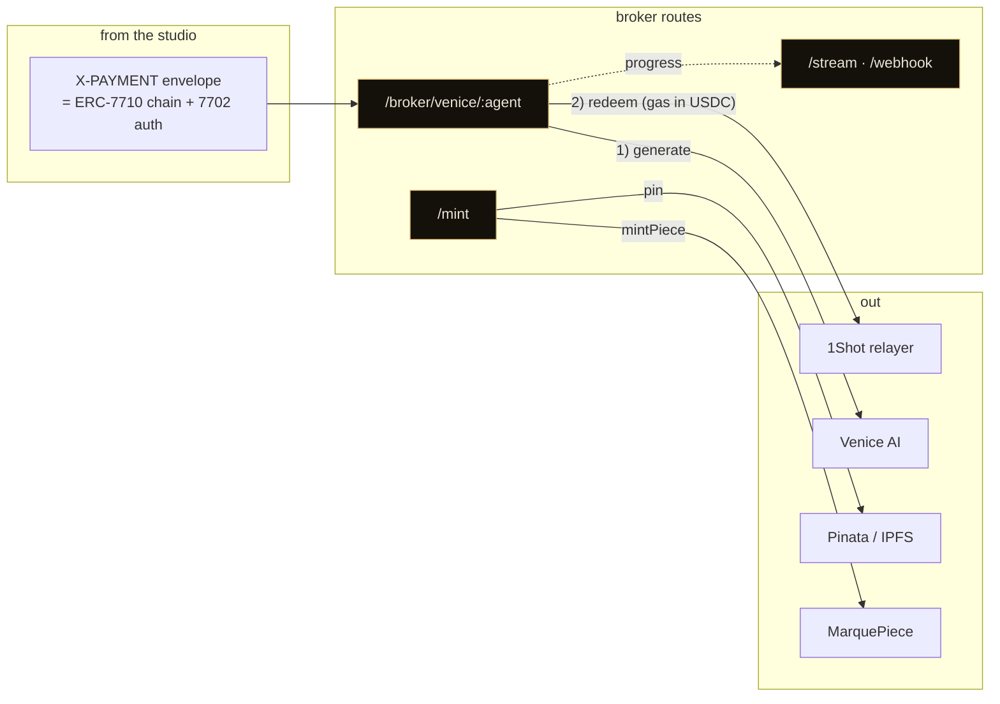
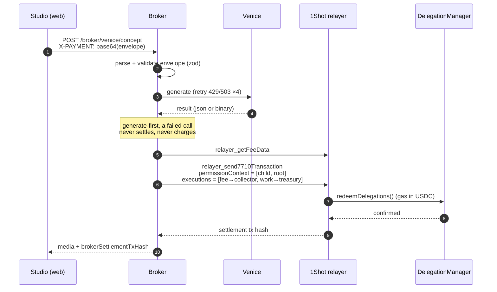
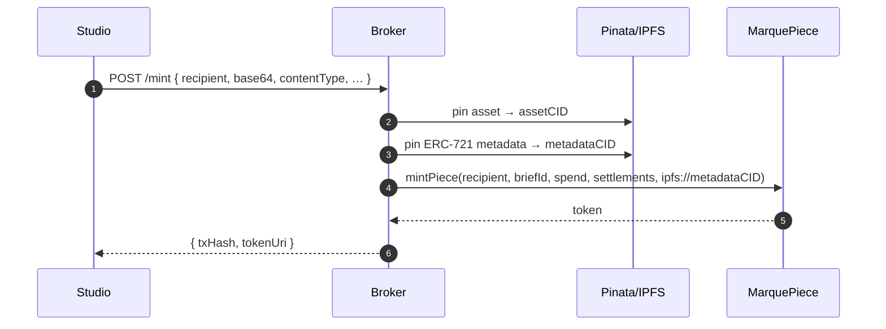

# 🛰 apps/broker

The **x402-7710 facilitator**. A small [Hono](https://hono.dev) server that turns an agent's signed ERC-7710 delegation chain into a real on-chain settlement through the **1Shot permissionless relayer**, runs the **Venice AI** inference, and mints the finished piece to **IPFS + Base mainnet**.

It is the only component that holds secrets (the Venice key, the treasury/float key, the Pinata key). The web app never does.

## What it does



## Routes

| Route | Auth | What |
|---|---|---|
| `POST /broker/venice/:agent` | Bearer | **The facilitator.** Generate with Venice, then redeem the delegation through 1Shot. Returns the media + settlement tx. |
| `POST /mint` | Bearer | Pin the asset + ERC-721 metadata to IPFS, then `mintPiece` to the recipient. |
| `POST /compose` | Bearer | ffmpeg stitch of clips/voice/music into a final MP4 (the full-render path). |
| `POST /generate` | Bearer | Server-side whole-pipeline generation (API-key path, no chain). |
| `GET /stream/brief/:id` | none | SSE timeline of agent events for a brief. |
| `POST /webhook/relay` | Ed25519 | 1Shot status callbacks (verified against the relayer JWKS). |
| `GET /health` | none | Liveness. |

## The facilitator flow: `POST /broker/venice/:agent`

This is the core. The studio posts a base64 **X-PAYMENT** header (the `marque-v1` envelope) carrying the signed delegation chain, plus a normal JSON body (the prompt).



The **X-PAYMENT envelope** (`marque-v1`):

```jsonc
{
  "scheme": "marque-v1",
  "network": "eip155:8453",
  "amountAtoms": "100000",          // USDC, 6 decimals
  "briefId": "0x…64",
  "specialistKind": "concept",      // concept | image | voice | music | video
  "delegations": [ child, root ],   // ERC-7710 chain (leaf first), toRelayerJson form
  "authorizationList": [ { address, chainId, nonce, r, s, yParity } ]  // EIP-7702, first call only
}
```

The two executions the relayer runs from the delegator's account:

1. transfer the 1Shot **fee** in USDC to the fee collector
2. transfer the **work** amount in USDC to the Marque treasury

## The mint flow: `POST /mint`



## Source map

| File | Responsibility |
|---|---|
| `src/index.ts` | Hono app, CORS, bearer middleware, route mounting |
| `src/routes/broker.ts` | the facilitator: envelope parse, `runVenice`, `relayDelegationRedemption` |
| `src/routes/mint.ts` | IPFS pin + `mintPiece` from the float |
| `src/oneshot.ts` | 1Shot JSON-RPC client (`getCapabilities`, `getFeeData`, `send7710Transaction`, `getStatus`) |
| `src/venice-rest.ts` | Venice client: sync (chat/image/tts) + async queue/poll (music/video), 429 retry |
| `src/pinata.ts` | Pinata v3 upload, `ipfs://` + gateway URLs |
| `src/webhook-verify.ts` | Ed25519 verification of 1Shot webhooks against JWKS |
| `src/state.ts` | in-memory task + SSE event bus |

## Configuration

Copy `.env.example` → `.env` (chmod 600). Key values:

| Var | Purpose |
|---|---|
| `BROKER_BEARER_TOKEN` | shared secret the web app sends |
| `BROKER_FLOAT_PRIVATE_KEY` / `BROKER_FLOAT_ADDRESS` | the treasury/float: pays mint gas, receives work amounts |
| `ONESHOT_RELAYER_URL` | `https://relayer.1shotapi.com/relayers` (mainnet) |
| `VENICE_API_BASE` / `VENICE_API_KEY` | Venice inference |
| `PINATA_JWT` / `PINATA_GATEWAY` / `PINATA_GATEWAY_TOKEN` | IPFS |
| `MARQUE_PIECE_ADDRESS` | the NFT contract |
| `DELEGATION_MANAGER_ADDRESS` / `USDC_BASE` / `BASE_RPC_URL` | chain config |

## Run

```bash
pnpm --filter @marque/broker dev      # tsx watch, 127.0.0.1:8789
pnpm --filter @marque/broker typecheck
```

In production it runs under `systemd` behind nginx (TLS), so it never needs `ONESHOT_WEBHOOK_PUBLIC_BASE_URL` to be a tunnel.
