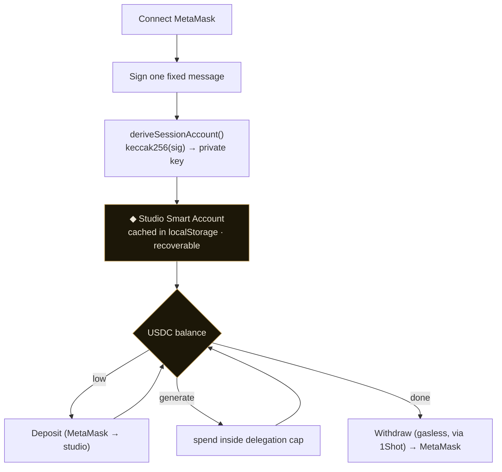
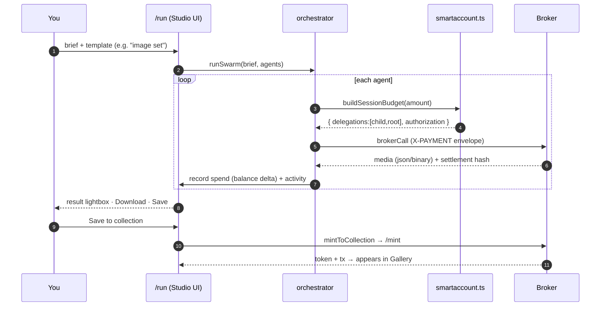

# 🖥 apps/web

The **studio**. A Next.js 15 app where you keep a USDC balance, describe what you want, watch an agent swarm make it, and collect the result as an NFT. None of the secrets live here: the web app only ever signs delegations with your studio account and posts them to the [broker](../broker/README.md).

## The studio account model

The heart of the UX is the **studio account**, a MetaMask Smart Account (Stateless EIP-7702) that *is* your balance. You never see "create a wallet"; connecting and signing once derives it deterministically.



- **Deterministic + recoverable.** The same wallet + the same signature always derive the same studio account, so your balance and gallery follow you across devices.
- **You control it.** The studio account's owner key is derived from *your* signature; the app caches it locally and never transmits it.
- **Withdraw anytime.** `withdrawSession` builds a gasless USDC transfer back to your MetaMask through the 1Shot relayer.

## The generate flow

When you hit **Make it**, the orchestrator runs one x402 call per agent in the template. Each call signs a fresh ERC-7710 chain with the studio account and posts it to the broker.



The delegation chain `buildSessionBudget` produces:

```
studio account ──root delegation──▶ director (ephemeral) ──redelegation──▶ 1Shot relayer target
     (USDC cap + expiry)                          (narrowed)
```

It returns `delegations: [child, root]` (leaf first) plus the EIP-7702 `authorization` for the studio account, sent on the first call only.

## Source map

| File | Responsibility |
|---|---|
| `src/lib/identities.ts` | `deriveSessionAccount` (signature → key), `loadCachedSessionAccount` (silent) |
| `src/lib/smartaccount.ts` | `toSessionSmartAccount`, `buildSessionBudget` (A2A chain), `withdrawSession`, balance helpers |
| `src/lib/studio.tsx` | `StudioProvider` / `useStudio`: account, balance, deposit/withdraw, activity log, wallet drawer state |
| `src/lib/orchestrator.ts` | `runSwarm`: per-agent `brokerCall` |
| `src/lib/broker.ts` | `brokerCall`: builds the X-PAYMENT envelope, handles json + binary responses |
| `src/lib/collect.ts` | `mintToCollection` (POST /mint), `urlToBase64` |
| `src/lib/gallery.ts` | `fetchPieces`: reads `PieceMinted` in chunked `getLogs`, resolves IPFS metadata |
| `src/components/Header.tsx` | logo + centered nav + wallet drawer (balance, deposit presets, activity, withdraw) |
| `src/app/run/` | the unified studio page (Sim / Live toggle; Live = real chain) |
| `src/app/gallery/` | the collection, keyed by studio account |

## Configuration

`.env.local` (all `NEXT_PUBLIC_` because they're read client-side):

| Var | Purpose |
|---|---|
| `NEXT_PUBLIC_BROKER_URL` | the broker base URL |
| `NEXT_PUBLIC_BROKER_BEARER_TOKEN` | bearer the broker expects |
| `NEXT_PUBLIC_BASE_RPC_URL` | Base mainnet RPC |
| `NEXT_PUBLIC_MINT_CONTRACT` | MarquePiece address |
| `NEXT_PUBLIC_MINT_DEPLOY_BLOCK` | first block to scan for `PieceMinted` |
| `NEXT_PUBLIC_PINATA_GATEWAY` / `NEXT_PUBLIC_PINATA_GATEWAY_TOKEN` | resolve `ipfs://` media |
| `NEXT_PUBLIC_DELEGATION_MANAGER` / `NEXT_PUBLIC_USDC` / `NEXT_PUBLIC_RELAYER_TARGET` | chain config |

## Run

```bash
pnpm --filter @marque/web dev          # Turbopack, localhost:3001
pnpm --filter @marque/web typecheck
pnpm --filter @marque/web build
```

> Tailwind scans `src/app`, `src/components`, **and `src/lib`**. The last is required because the wallet drawer and modals live under `src/lib`.
