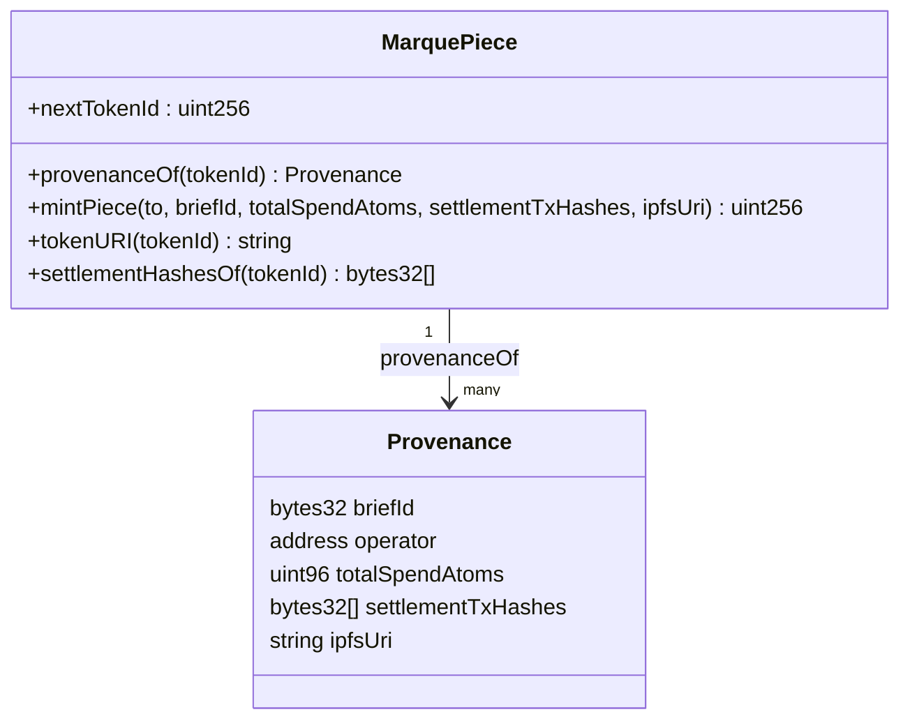
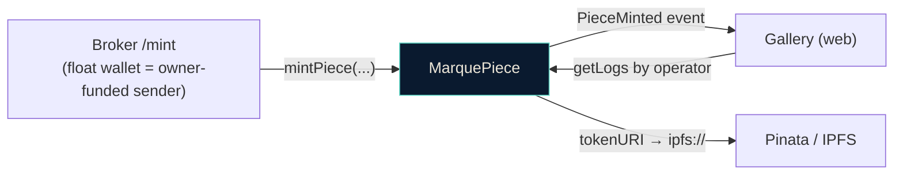

# ⛓ contracts

**MarquePiece** is the ERC-721 that turns a finished piece into a provenance-bearing NFT. Every token records *what was made*, *who it was made for*, *how much it cost*, and *the on-chain settlements that paid for it*. The media lives on IPFS; the receipt lives on-chain.

Foundry · Solidity 0.8.27 · OpenZeppelin ERC-721 + Ownable.

## What a token records



| Field | Meaning |
|---|---|
| `briefId` | the brief the piece was generated from |
| `operator` | recipient = the studio account that paid (also the token owner) |
| `totalSpendAtoms` | total USDC spent across the swarm, 6-decimal atoms |
| `settlementTxHashes` | every 1Shot redemption tx that funded the work |
| `ipfsUri` | `ipfs://…` of the ERC-721 metadata (returned by `tokenURI`) |

`mintPiece` **reverts with `EmptyProvenance`** if `settlementTxHashes` is empty, so a piece cannot be minted unless it was actually paid for on-chain. That coupling is the point: the NFT is a verifiable receipt, not just an image pointer.

## Where it sits



The broker's float wallet sends the `mintPiece` tx (paying gas), but the token is `_safeMint`ed to the **studio account** (`to`), so the user owns it. The gallery reads `PieceMinted` filtered by `operator`.

## Deployed (Base mainnet)

| | |
|---|---|
| Address | [`0x478Bb80C56a708ded5A2f3D2EA0d204aEE92a01b`](https://basescan.org/address/0x478Bb80C56a708ded5A2f3D2EA0d204aEE92a01b#code) |
| Name / symbol | `Marque Piece` / `MARQUE` |
| Verified | yes (Basescan) |

## Develop

```bash
forge build
forge test
forge fmt
```

## Deploy + verify

```bash
forge script script/Deploy.s.sol:DeployMarquePiece \
  --rpc-url "$BASE_RPC_URL" \
  --private-key "$DEPLOYER_PRIVATE_KEY" \
  --broadcast \
  --verify --etherscan-api-key "$ETHERSCAN_API_KEY"
```

The constructor takes `initialOwner` (the float/treasury address). `Deploy.s.sol` reads it from env so the same key that mints also owns the contract.
